<div align="center">

# 🧙‍♂️ Ruaroa AI
### *Zero-Code Machine Learning Wizard*

[](https://opensource.org/licenses/MIT)
[](https://pypi.org/project/ruaroa-ai/)
[](https://www.python.org/downloads/release/python-3100/)
[](#-live-demo--visual-walkthrough)

---

**✨ Transform ideas into intelligent solutions without writing a single line of code**

*Ruaroa AI is your personal ML wizard that conjures complete machine learning pipelines from simple natural language descriptions. Just describe what you want, upload your data, and watch the magic happen!*

</div>

## 🪄 The Magic Behind Ruaroa AI

Ruaroa AI is not just another ML tool—it's your intelligent coding companion that transforms complex machine learning challenges into simple conversations. Using advanced AI reasoning and iterative experimentation, it crafts production-ready solutions that would typically require weeks of expert development.

### 🎯 Core Features

<table>
<tr>
<td width="50%">

**🗣️ Natural Language Interface**
- Describe your ML problem in plain English
- Add domain expertise and requirements
- No coding knowledge required to get started

**🔬 Iterative Optimization**
- Automatically runs, debugs, and improves code
- Self-correcting algorithm that learns from failures
- Continuous performance enhancement

</td>
<td width="50%">

**📝 Production-Ready Code**
- Generates clean, tested Python scripts
- Full transparency and reproducibility
- Easy to customize and extend

**📊 Visual Insights**
- Interactive solution tree visualization
- Understand the experimentation process
- See what works and what doesn't

</td>
</tr>
</table>

## 🎭 Cast Your First Spell - Getting Started

### 🌟 Web Wizard Interface (Magical Experience)

Step into the enchanted world of automated machine learning through our spellbinding web interface - where data science dreams become reality with just a few clicks!

### 🧪 Preparing Your Magical Environment

Before summoning the ML wizard, ensure your system is ready for magic:

**Install the Wizard:**
```bash
pip install -U ruaroa-ai
```

**Awaken the Web Interface:**
```bash
streamlit run ruaroa/webui/app.py
```

### 🪄 The Spellcasting Process

<div align="center">

**✨ From Data to Insights in 6 Magical Steps ✨**

</div>

<table>
<tr>
<td width="50%">

**🔑 1. Unlock the Wizard's Power**
Configure your AI keys in the mystical sidebar - OpenAI or Anthropic will serve as your magical conduit to intelligence.

**📊 2. Present Your Data Scrolls**
- Drag & drop your data files (CSV, JSON, TXT) into the enchanted upload zone
- Or summon our example Bitcoin dataset with a single click

**🎯 3. Speak Your Desires**
Tell the wizard what you seek in plain English:
- *"Predict tomorrow's Bitcoin price"*
- *"Find customers likely to churn"*
- *"Classify these images accurately"*

</td>
<td width="50%">

**⚙️ 4. Set the Magical Intensity**
Choose how many iterations the wizard should perform - more steps mean more powerful spells!

**🚀 5. Begin the Incantation**
Click "Run Ruaroa AI" and watch as the wizard:
- Analyzes your data with mystical insight
- Generates multiple solution approaches
- Tests and refines each magical formula

**🏆 6. Witness the Magic**
Explore your results through enchanted views:
- **🌳 Solution Tree**: See every spell the wizard tried
- **💻 Generated Code**: Your production-ready ML potion
- **📊 Performance Metrics**: Proof of the magic's power

</td>
</tr>
</table>


---

## ⚡ Terminal Sorcery - Command Line Magic

### 🔮 Summoning the Wizard via Terminal

For developers who prefer the mystical power of command lines, invoke Ruaroa AI directly from your terminal:

**Conjure the Wizard:**
```bash
pip install -U ruaroa-ai
```

**Bind Your AI Familiar:**
```bash
export OPENAI_API_KEY=your_magical_key
# or choose your preferred AI companion
export ANTHROPIC_API_KEY=your_anthropic_key
```

### 🎪 Spellcasting Examples

**The Basic Incantation:**
```bash
ruaroa data_dir="./your_data" \
      goal="Transform this data into predictions" \
      eval="Measure success with accuracy"
```

**Real Example - House Price Prediction:**
```bash
ruaroa data_dir="example_tasks/house_prices" \
      goal="Estimate property values for residential homes" \
      eval="Apply Root Mean Square Error on log-transformed predictions vs actual values."
```

### ⚙️ Configuration Options

| Parameter | Required | Description | Example |
|-----------|----------|-------------|---------|
| `data_dir` | ✅ | Directory containing your dataset files | `"./my_data"` |
| `goal` | ✅ | What you want the model to achieve | `"Predict customer churn"` |
| `eval` | ⚪ | Evaluation metric for model performance | `"F1 score"`, `"RMSE"` |
| `steps` | ⚪ | Number of optimization iterations | `10` (default) |

Alternatively, you can provide the entire task description as a `desc_str` string, or write it in a plaintext file and pass its path as `desc_file` ([example file](ruaroa/example_tasks/house_prices.md)).

```bash
ruaroa data_dir="my_data_dir" desc_file="my_task_description.txt"
```

The result of the run will be stored in the `logs` directory.

- `logs/<experiment-id>/best_solution.py`: Python code of the _best solution_ according to the validation metric.
- `logs/<experiment-id>/journal.json`: A JSON file containing the metadata of the experiment runs, including all the code generated in intermediate steps, plan, evaluation results, etc.
- `logs/<experiment-id>/tree_plot.html`: You can open it in your browser. It contains a visualization of the solution tree, which details the experimentation process of finding and optimizing ML code. You can explore and interact with the tree visualization to view what plan and code Ruaroa AI comes up with in each step.

The `workspaces` directory will contain all the files and data that the agent generated.

### Advanced Usage

To further customize the behavior of Ruaroa AI, some useful options might be:

- `agent.code.model=...` to configure which model the agent should use for coding (default is `gpt-4-turbo`).
- `agent.steps=...` to configure how many improvement iterations the agent should run (default is 20).
- `agent.search.num_drafts=...` to configure the number of initial drafts the agent should generate (default is 5).

You can check the [`config.yaml`](ruaroa/utils/config.yaml) file for more options.

### Using Local LLMs

Ruaroa AI supports using local LLMs through OpenAI-compatible APIs. Here's how to set it up:

1. Set up a local LLM server with an OpenAI-compatible API endpoint. You can use:
   - [Ollama](https://github.com/ollama/ollama)
   - or similar solutions.

2. Configure your environment to use the local endpoint:

   ```bash
   export OPENAI_BASE_URL="http://localhost:11434/v1"  # For Ollama
   export OPENAI_API_KEY="local-llm"  # Can be any string if your local server doesn't require authentication
   ```

3. Update the model configuration in your Ruaroa AI command or config. For example, with Ollama:

   ```bash
   # Example with house prices dataset
   ruaroa agent.code.model="qwen2.5" agent.feedback.model="qwen2.5" report.model="qwen2.5" \
       data_dir="example_tasks/house_prices" \
       goal="Predict the sales price for each house" \
       eval="Use the RMSE metric between the logarithm of the predicted and observed values."
   ```

## Using Ruaroa AI in Python

Using Ruaroa AI within your Python script/project is easy. Follow the setup steps above, and then create a Ruaroa AI experiment like below and start running:

```python
import ruaroa
exp = ruaroa.Experiment(
    data_dir="example_tasks/bitcoin_price",  # replace this with your own directory
    goal="Build a time series forecasting model for bitcoin close price.",  # replace with your own goal description
    eval="RMSLE"  # replace with your own evaluation metric
)

best_solution = exp.run(steps=10)

print(f"Best solution has validation metric: {best_solution.valid_metric}")
print(f"Best solution code: {best_solution.code}")
```

## Development

To install Ruaroa AI for development, clone this repository and install it locally:

```bash
git clone https://github.com/RuaroaAI/ruaroa-ai.git
cd ruaroa-ai
pip install -e .
```

### Running the Web UI in Development Mode

Ensure that you have all the required development dependencies installed. Then, you can run the Web UI as follows:

```bash
cd ruaroa/webui
streamlit run app.py
```

## 🐳 Containerized Magic - Docker Enchantment

Summon the wizard within an enchanted Docker container for ultimate portability and isolation:

### 🏗️ Forge Your Magical Container

**1. Craft the Wizard's Vessel:**
```bash
docker build -t ruaroa-wizard .
```

**2. Unleash the Containerized Wizard:**
```bash
# Prepare your magical workspace
export WIZARD_WORKSPACE=$(pwd)/enchanted_workspaces
export SPELL_LOGS=$(pwd)/magical_logs

# Invoke the containerized wizard
docker run -it --rm \
           -v "${SPELL_LOGS:-$(pwd)/logs}:/app/logs" \
           -v "${WIZARD_WORKSPACE:-$(pwd)/workspaces}:/app/workspaces" \
           -v "$(pwd)/ruaroa/example_tasks:/app/data" \
           -e OPENAI_API_KEY="your-magical-key" \
           ruaroa-wizard \
           data_dir=/app/data/house_prices \
           goal="Divine the true value of each dwelling" \
           eval="Measure wisdom using RMSE on logarithmic prophecies"
```

### ⚙️ Customize Your Magical Realm

Configure your wizard's domain with these mystical environment variables:

- **`WIZARD_WORKSPACE`**: Your enchanted laboratory directory (default: `./workspaces`)
- **`SPELL_LOGS`**: Chronicle of all magical experiments (default: `./logs`)

---

## 🤝 Join the Wizard's Guild

**Contribution guide will be available soon - help us expand the magical realm!**

---

## 👨‍💻 Meet the Wizard

**Developed with ❤️ by [Vimal](https://github.com/vimal)**

*Transforming the future of machine learning, one spell at a time.*

---

## 🧠 How Ruaroa AI Works

<div align="center">

### 🔄 Solution Space Tree Search Algorithm

*Inspired by how human data scientists approach complex problems*

</div>

Ruaroa AI employs an intelligent **Solution Space Tree Search** methodology that mirrors the iterative problem-solving approach of experienced data scientists. The system generates multiple solution candidates and systematically refines them through continuous experimentation.

### 🏗️ Core Components

<table>
<tr>
<td width="33%" align="center">

**🎯 Solution Generator**

Creates novel ML approaches and iteratively improves existing solutions through intelligent code modifications

</td>
<td width="33%" align="center">

**📊 Performance Evaluator**

Automatically runs and benchmarks each solution, extracting key metrics to guide the optimization process

</td>
<td width="33%" align="center">

**🎖️ Solution Selector**

Identifies the most promising candidates to serve as the foundation for the next iteration cycle

</td>
</tr>
</table>

### 🔄 The Process

1. **🌱 Initial Generation** → Create diverse solution approaches
2. **🧪 Experimentation** → Test and evaluate each candidate  
3. **📈 Performance Analysis** → Extract insights from results
4. **🔧 Refinement** → Improve promising solutions
5. **🎯 Convergence** → Deliver the optimal solution

This systematic exploration ensures Ruaroa AI discovers high-quality solutions while learning from both successes and failures throughout the process.

---

## 🎬 Live Demo & Visual Walkthrough

### 📺 Complete Demo Video

<div align="center">

**🎥 Watch Ruaroa AI in Action - Full Bitcoin Price Prediction Demo**

[](Output/App%20Demo.mp4)

*Experience the complete workflow from data upload to production-ready ML code generation*

</div>

### 🖼️ Step-by-Step Visual Guide

<table>
<tr>
<td width="50%" align="center">

**🚀 1. Getting Started**
<br>

<br>
*Clean, intuitive interface with API key setup and file upload*

</td>
<td width="50%" align="center">

**📊 2. Data Upload & Configuration**
<br>

<br>
*Simple drag-and-drop data upload with goal specification*

</td>
</tr>
<tr>
<td width="50%" align="center">

**⚡ 3. AI Processing in Action**
<br>

<br>
*Real-time progress tracking as AI generates solutions*

</td>
<td width="50%" align="center">

**🌳 4. Interactive Solution Tree**
<br>

<br>
*Visual exploration of AI's experimentation process*

</td>
</tr>
<tr>
<td width="50%" align="center">

**🏆 5. Generated ML Code**
<br>

<br>
*Production-ready Python code with comprehensive ML pipeline*

</td>
<td width="50%" align="center">

**⚙️ 6. System Configuration**
<br>

<br>
*Detailed configuration and experiment settings*

</td>
</tr>
<tr>
<td width="50%" align="center">

**📖 7. Experiment Journal**
<br>

<br>
*Complete log of AI's decision-making process*

</td>
<td width="50%" align="center">

**📊 8. Performance Analytics**
<br>

<br>
*Comprehensive performance metrics and visualizations*

</td>
</tr>
</table>

### 🔄 Ruaroa AI Workflow Architecture

```mermaid
graph TD
    A[📁 Data Upload] --> B[🎯 Goal Definition]
    B --> C[⚙️ System Configuration]
    C --> D[🚀 AI Processing Starts]
    
    D --> E[🧠 Solution Generation]
    E --> F[🔬 Code Testing & Validation]
    F --> G[📊 Performance Evaluation]
    G --> H{🎯 Goal Achieved?}
    
    H -->|No| I[🔧 Solution Refinement]
    I --> E
    H -->|Yes| J[🏆 Best Solution Selected]
    
    J --> K[📋 Results Package]
    K --> L[🌳 Interactive Tree View]
    K --> M[💻 Production Code]
    K --> N[📊 Performance Metrics]
    K --> O[📖 Experiment Journal]
    
    style A fill:#e1f5fe
    style D fill:#f3e5f5
    style J fill:#e8f5e8
    style K fill:#fff3e0
```



### 🛠️ Core Technology Stack

<div align="center">

| **Component** | **Technology** | **Purpose** |
|---------------|----------------|-------------|
| 🤖 **AI Engine** | OpenAI GPT-4, Anthropic Claude | Code generation & optimization |
| 🐍 **ML Framework** | scikit-learn, pandas, numpy | Machine learning implementation |
| 🎨 **Frontend** | Streamlit | Interactive web interface |
| 📊 **Visualization** | Plotly, Matplotlib | Data & results visualization |
| 🌳 **Tree Rendering** | P5.js, HTML5 Canvas | Interactive solution exploration |
| ⚙️ **Configuration** | OmegaConf, YAML | Experiment management |
| 📝 **Logging** | Rich Console, JSON | Process tracking & debugging |

</div>

### ✨ Key Features Demonstrated

- **🎯 Zero-Code Interface**: No programming knowledge required
- **🤖 Intelligent Automation**: AI handles entire ML pipeline
- **🌳 Visual Exploration**: Interactive tree of solution attempts  
- **📊 Real-time Progress**: Live updates during processing
- **💻 Production Code**: Clean, documented, executable Python
- **📈 Performance Tracking**: Comprehensive metrics and charts
- **🔄 Iterative Improvement**: Self-optimizing algorithm
- **📖 Full Transparency**: Complete experiment journal

---

<div align="center">

## 🌟 Ready to Transform Your ML Workflow?

**Get started with Ruaroa AI today and experience the future of automated machine learning!**

```bash
pip install -U ruaroa-ai
```

*Built with ❤️ for the data science community*

---

**📄 License:** MIT | **🐍 Python:** 3.10+ | **🚀 Status:** Production Ready

</div>
